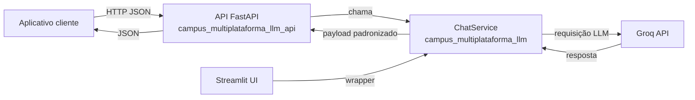

# Detector de Fake News Campus Multiplataforma

**Poderosa IA capaz de detectar fake news sobre assuntos gerais.**

O Detector de Fake News do Campus Multiplataforma trata-se de um projeto de pesquisa que visa apoiar alunos de jornalismo e usuários do aplicativo Campus Multiplataforma a se informarem e conseguirem destingir noticias reais de notícias falsas.

## Porque esse projeto existe?

Levando em conta a velocidade da disseminação de desinformação e notícias falsas na rede, esse projeto foi desenvolvido visando ajudar as pessoas a reconhecer possíveis fake news que possam estar sendo disseminadas. O objetivo desse projeto é:

* Desmentir notícias falsas
* Apoiar jornalistas na detecção de notícias falsas
* Instruir os usuários e seguidores do Campus multiplataforma sobre eventuais notícias com viés de enganação.

## Informações técnicas:

* **Backend**: Python 3.10+
* **Web Framework**: Streamlit
* **AI APIs**:
    * Groq

## Estrutura do projeto
```
src/
├── campus_multiplataforma_llm/      # Camada pública reutilizável (biblioteca)
│   ├── __init__.py
│   └── chat_service.py              # Serviço de chat usado por app externo e API
├── campus_multiplataforma_llm_api/   # Camada pública HTTP (FastAPI)
│   ├── main.py                       # Endpoints /health, /models e /chat
│   └── schemas.py                    # Contratos de entrada e saída da API
├── streamlit_app.py                  # Ponto de entrada do chatbot web (UI)
├── presentation_streamlit/           # Interface (telas Streamlit)
│   └── chat.py
├── service_streamlit/                # Adaptadores do Streamlit
│   ├── llm.py                        # Wrapper para a camada pública
│   └── utils.py                      # Leitura de segredos e utilitários de UI
├── config/
│   ├── prompts.py                    # Prompts base usados pelo chatbot
│   └── settings.py                   # Lista de modelos disponíveis
└── llm_benchmark/                    # Módulo interno de benchmark (não é recurso da API)
    ├── main.py                       # Ponto de entrada do benchmark
    ├── prompt/builder.py
    ├── llm/groq_client.py
    ├── datasets/                     # Carregamento e processamento dos dados de teste
    ├── metrics/metrics.py            # Cálculo de métricas de desempenho
    └── results/                      # Tratamento e exportação dos resultados
```

## Fluxo de integração



Resumo do fluxo:

1. O aplicativo cliente envia uma mensagem para o endpoint `/chat`.
2. A API valida payload/modelo e resolve a chave da Groq.
3. A API delega a geração da resposta ao `ChatService`.
4. O `ChatService` conversa com a Groq e retorna resposta estruturada.
5. A API devolve JSON para o aplicativo cliente.
6. A interface Streamlit também usa o mesmo `ChatService`, mas não passa pela API HTTP.

## Bora Começar

**Prerrequisitos**:

* Python 3.10 ou maior
* Git (opcional, para clonar)
* uv 0.9.30
* Chaves de API:
    * Chave de API Groq

**Configurando**:

1. **Clone o repositório (ou baixe os arquivos):**

    ```bash
    git clone https://github.com/RafaBonach/detector-fake-news-jornal-campus.git
    cd detector-fake-news-jornal-campus
    ```

2. **Cria e ativa o ambiente virtual:**

    ```bash
    python -m venv venv
    # On macOS/Linux:
    source venv/bin/activate
    # On Windows:
    .\venv\Scripts\activate
    ```

3. **Instala as dependências**

    ```bash
    uv sync
    ```

4. **Configura a chave de API**
    * Copie [secrets.toml.exemple](.streamlit/secrets.toml.exemple) dentro do diretório [.streamlit](.streamlit/) em um arquivo chamado `secrets.toml` (crie a pasta `.streamlit` se ela não existir)
    * Adicione sua chave de API (mais instruções  no arquivo de exemplo)

        ```toml
        # For use Groq
        GROQ_API_KEY="your_groq_api_key"
        GROQ_API_KEY_ANALYSER="your_groq_api_key" #chave usada pelo analisador.
        ```
    > ⚠️ **IMPORTANTE:** A chave de api deve estar necessariamente entre parenteses ("chave_de_api").

    > A aplicação Streamlit e a API HTTP usam as chaves deste arquivo `.streamlit/secrets.toml`.

5. **Configurando os prompts**
    * Reveja [src/config/prompts.py](src/config/prompts.py) para modificar os prompts usado pelo chatbot.
    * Reveja [src/config/settings.py](src/config/settings.py) para modificar a lista de modelos disponíveis no seletor.

## Rodando a aplicação

Esse projeto consiste em um servidor web ([src/streamlit_app.py](src/streamlit_app.py)) para interagir com a LLM e um módulo de benchmark ([src/llm_benchmark/](src/llm_benchmark/)) para analisar o desempenho dos modelos.

* **Comandos:**

    * Webapp:
        ```bash
        # Usando Makefile
        make streamlit
        # Usando comando direto
        uv run streamlit run src/streamlit_app.py
        ```

## Integração Como Biblioteca

O projeto agora expõe uma camada pública em `campus_multiplataforma_llm` para uso por outros aplicativos Python.

Exemplo mínimo:

```python
from campus_multiplataforma_llm import ChatService

service = ChatService(
    model_name="groq/compound",
    api_key="sua-chave-da-groq",
)

response = service.ask(
    "Essa notícia é verdadeira ou falsa?",
    history=[{"role": "user", "content": "Notícia anterior"}],
)

print(response.content)
```

O objeto retornado por `ask()` contém o texto final da resposta, o nome do modelo usado e as mensagens enviadas ao provedor. Isso facilita integrar o chat em outro frontend sem depender de `st.session_state`.

## Integração Via API HTTP

Além da integração por biblioteca, o projeto também expõe uma API HTTP usando FastAPI.

### Subir a API

```bash
# Usando Makefile
make api

# Ou diretamente
uv run uvicorn campus_multiplataforma_llm_api.main:app --host 0.0.0.0 --port 8000 --reload
```

### Variáveis de ambiente

- `GROQ_API_KEY`: opcional. Se não estiver no ambiente, a API tentará ler a chave em `.streamlit/secrets.toml`
- `LLM_DEFAULT_MODEL`: opcional (define modelo padrão)
- `CORS_ALLOW_ORIGINS`: opcional, lista separada por vírgula (ex.: `http://localhost:3000,http://localhost:5173`)

### Origem da chave da API

Para funcionar corretamente em desenvolvimento, crie o arquivo `.streamlit/secrets.toml` com base no arquivo `.streamlit/secrets.toml.exemple` e preencha as chaves da Groq.

Ordem de resolução da chave no endpoint `/chat`:

1. Variável de ambiente `GROQ_API_KEY` (quando definida).
2. Campo `GROQ_API_KEY` no arquivo `.streamlit/secrets.toml`.

Se nenhuma dessas fontes estiver disponível, a API responderá erro informando ausência de chave.

### Endpoints

- `GET /health`
- `GET /models`
- `POST /chat`

Exemplo de resposta `GET /health`:

```json
{
    "status": "ok",
    "api_key_configured": true
}
```

Exemplo de resposta `GET /models`:

```json
{
    "models": [
        "groq/compound",
        "groq/compound-mini",
        "openai/gpt-oss-120b",
        "openai/gpt-oss-20b",
        "openai/gpt-oss-safeguard-20b"
    ],
    "default_model": "groq/compound"
}
```

Exemplo de requisição:

```bash
curl -X POST "http://localhost:8000/chat" \
    -H "Content-Type: application/json" \
    -d '{
        "message": "Essa notícia é verdadeira ou falsa?",
        "model_name": "groq/compound",
        "history": [
            {"role": "user", "content": "Mensagem anterior"}
        ]
    }'
```

Exemplo de resposta `POST /chat`:

```json
{
    "response": "Classificação: VERDADEIRA\nJustificativa: ...",
    "model_name": "groq/compound",
    "messages": [
        {
            "role": "system",
            "content": "...prompt base..."
        },
        {
            "role": "user",
            "content": "Mensagem anterior"
        },
        {
            "role": "user",
            "content": "Essa notícia é verdadeira ou falsa?"
        }
    ]
}
```

### Erros possíveis no endpoint `/chat`

| HTTP Status | Código (`detail.error`) | Quando ocorre | Exemplo simplificado de resposta |
|---|---|---|---|
| 400 | `invalid_model` | Quando `model_name` não está na lista de modelos suportados. | `{"detail": {"error": "invalid_model", "message": "Modelo informado não é suportado.", "available_models": ["..."]}}` |
| 500 | `missing_api_key` | Quando a API não encontra chave nem em `GROQ_API_KEY` nem em `.streamlit/secrets.toml`. | `{"detail": {"error": "missing_api_key", "message": "Defina GROQ_API_KEY no ambiente ou em .streamlit/secrets.toml para usar o endpoint /chat."}}` |
| 502 | `llm_provider_error` | Quando o provedor LLM retorna erro durante a geração da resposta. | `{"detail": {"error": "llm_provider_error", "message": "...mensagem de erro do provedor..."}}` |

### Escopo da API

O diretório `src/llm_benchmark/` é destinado a benchmarking e testes internos de modelos.

Ele **não** faz parte da API HTTP pública e não deve ser tratado como recurso de integração do aplicativo cliente.

## Rodando no Docker

Alternativamente a execução local, você pode rodar o projeto usando Docker.
O projeto possui os arquivos `Dockerfile` e `compose.yml` que ajudaram na inicialização do docker.
O arquivo `Makefile` também possui comando que simplificação a inicialização.

**Comandos Make disponíveis:**

* `make build`: Constrói a imagem Docker.
* `make up`: Inicia a aplicação web.
* `make run-web`: Roda a aplicação web no docker.
* `make lint`: Roda o verificador de código.
* `make format`: Roda o formatador de código.

**Construa a imagem do Docker:**

```bash
make build
```

**Rode a aplicação usando Docker Compose:**

Para rodar a aplicação web, use:

```bash
make up
```

Depois de rodar esse comando, você poderá acessar a interface web pelo caminho `http://localhost:8501`.

Você pode encerrar a aplicação com `CTRL+C` na linha de comando momentos depois.

## Licença
Esse projeto está licenciado por **GNU Affero General Public License v3.0 (AGPLv3)**.

Resumindo a licença, você pode modificar, distribuir esse software ou rodar uma versão modificada como um serviço de internet em que os usuário irão interagir com o software, você só **deve** disponibilizar o código-fonte completo correspondente à sua versão sob a licença AGPLv3.

Você pode ler o texto completo da licença aqui:
[https://www.gnu.org/licenses/agpl-3.0.html](https://www.gnu.org/licenses/agpl-3.0.html)